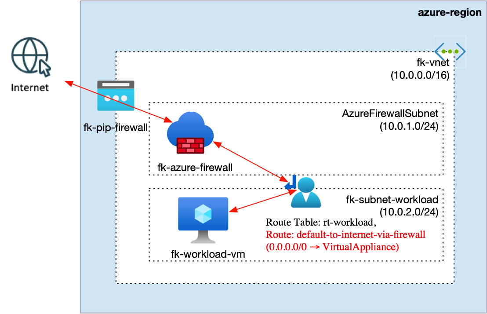
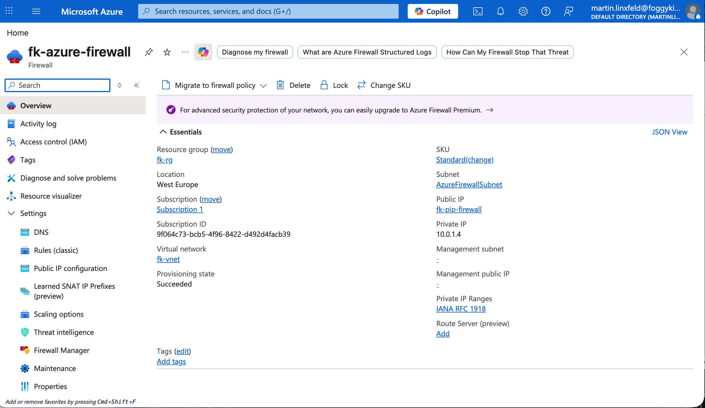
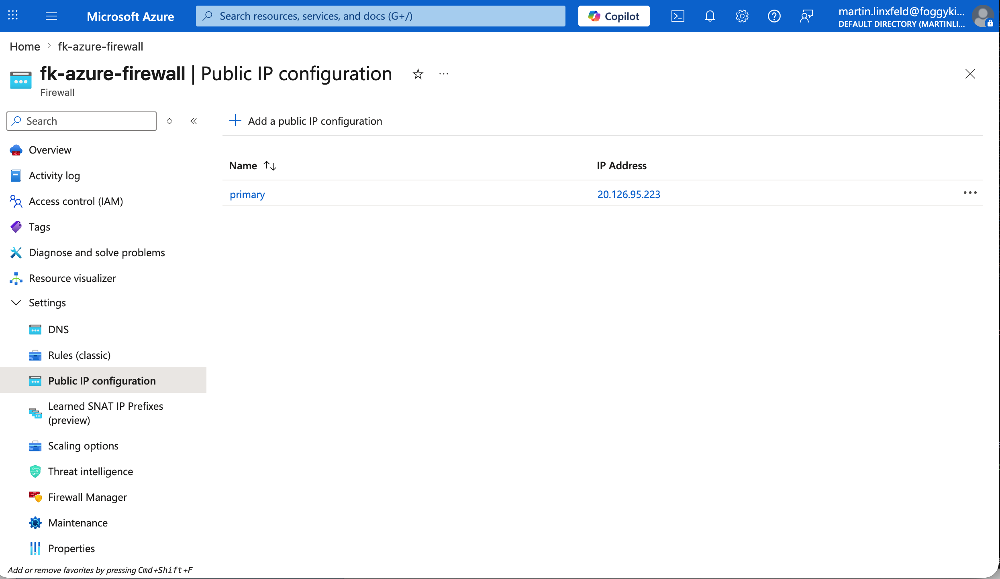
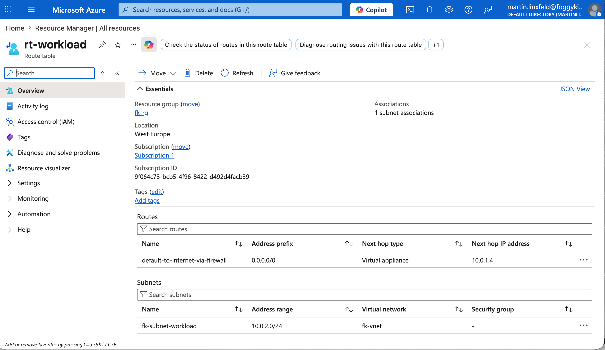
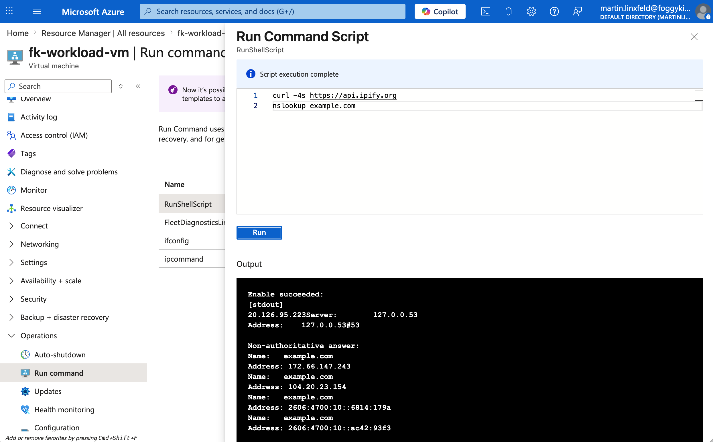
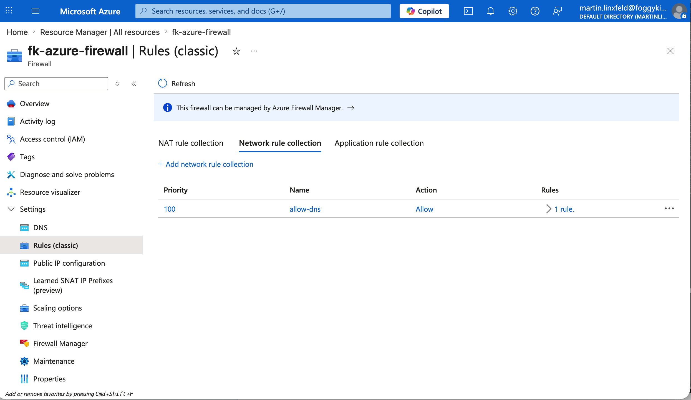
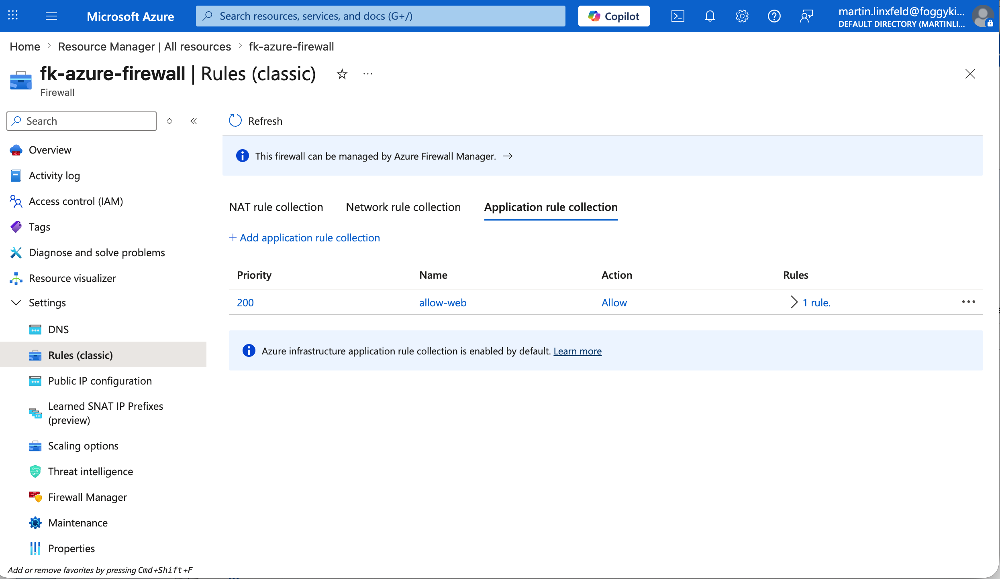

# Example 01: Basic Azure Firewall

In this example, we deploy a simple but usable **Azure Firewall** in a single VNet.

This is the simplest practical starting point for the module and focuses on a single, useful flow:

- a workload VM placed in a dedicated workload subnet
- a route table with `0.0.0.0/0` pointing to Azure Firewall
- Azure Firewall used for outbound Internet inspection
- basic network and application rule collections

There are intentionally **no spokes and no peering** in this example.

## Architecture Overview

This deployment creates:

- A Resource Group
- Virtual Network (via `terraform-az-fk-vnet`):
  - `fk-vnet` (`10.0.0.0/16`)
- Firewall subnet (via `terraform-az-fk-vnet`):
  - `AzureFirewallSubnet` (`10.0.1.0/24`)
- Workload subnet (via `terraform-az-fk-vnet`):
  - `fk-subnet-workload` (`10.0.2.0/24`)
- Standard public IP (via `terraform-az-fk-public-ip`):
  - `fk-pip-firewall`
- Azure Firewall (via `terraform-az-fk-firewall`):
  - `fk-azure-firewall`
  - private IP allocated from `AzureFirewallSubnet`
- Workload VM (via `terraform-az-fk-compute`):
  - `fk-workload-vm` (`10.0.2.4`)
- Route table (via `terraform-az-fk-routing`):
  - `rt-workload`
  - default route `0.0.0.0/0` with `VirtualAppliance` next hop set to the Azure Firewall private IP



## Rule Design

The example configures two intentionally simple rule collections:

- `network_rule_collections`
  - allow DNS outbound from `10.0.0.0/16` to `8.8.8.8` and `1.1.1.1`
- `application_rule_collections`
  - allow HTTP/HTTPS outbound from `10.0.0.0/16` to any FQDN

This keeps the example focused on:

- how to deploy Azure Firewall
- how to attach public and private addressing
- how to define basic firewall rules with this module
- how to steer outbound workload traffic through the firewall with UDR

## Deployment Steps

Initialize and apply the configuration:

```bash
tofu init
tofu plan
tofu apply
```

After deployment, Terraform will output:

- Hub VNet ID
- Workload VM ID and private IP
- Azure Firewall ID and name
- Azure Firewall private IP
- Firewall public IP ID
- Route table IDs

## Validation

After deployment, validate that the workload subnet uses Azure Firewall as its default egress path.

### 1. Confirm the firewall public IP

```bash
az network public-ip show \
  -g fk-rg \
  -n fk-pip-firewall \
  --query ipAddress \
  -o tsv
```

Expected result:

- the command returns the public IP assigned to `fk-pip-firewall`

### 2. Confirm the workload subnet route table

```bash
az network route-table show \
  -g fk-rg \
  -n rt-workload \
  --query "routes[].{name:name,addressPrefix:addressPrefix,nextHopType:nextHopType,nextHopIpAddress:nextHopIpAddress}" \
  -o table
```

Expected result:

- route `0.0.0.0/0` is present
- `nextHopType = VirtualAppliance`
- `nextHopIpAddress = <Azure Firewall private IP>`
- `VirtualAppliance` in this example means the private IP address of `fk-azure-firewall`

### 3. Validate outbound connectivity from the workload VM

```bash
az vm run-command invoke \
  -g fk-rg \
  -n fk-workload-vm \
  --command-id RunShellScript \
  --scripts "curl -4s https://api.ipify.org; echo; curl -I https://example.com"
```

Expected result:

- `curl https://api.ipify.org` returns a public IP
- `curl -I https://example.com` returns a valid HTTP response

### 4. Validate DNS resolution from the workload VM

```bash
az vm run-command invoke \
  -g fk-rg \
  -n fk-workload-vm \
  --command-id RunShellScript \
  --scripts "nslookup example.com; getent hosts example.com"
```

Expected result:

- DNS resolution succeeds
- the hostname resolves to one or more public IP addresses

### 5. Compare the VM egress IP with the firewall public IP

The IP returned by:

```bash
curl -4s https://api.ipify.org
```

from `fk-workload-vm` should match the IP returned by:

```bash
az network public-ip show \
  -g fk-rg \
  -n fk-pip-firewall \
  --query ipAddress \
  -o tsv
```

This confirms that outbound traffic from the workload subnet is leaving through Azure Firewall.

## Azure Portal Verification

The following screenshots document the deployed architecture and the outbound traffic path through Azure Firewall.

### 1. Azure Firewall Overview

- `fk-azure-firewall` overview page
- resource group
- region
- SKU
- visible private/public IP summary if available

Purpose:

- confirms that Azure Firewall is deployed as the central security and egress component in the example



### 2. Firewall IP Configuration

- firewall IP configuration view
- `AzureFirewallSubnet`
- firewall private IP
- attached `fk-pip-firewall`

Purpose:

- confirms that Azure Firewall has a private IP inside `AzureFirewallSubnet`
- confirms that the firewall is attached to the Public IP created via `terraform-az-fk-public-ip`



### 3. Workload Route Table

- route table `rt-workload`
- route `default-to-internet-via-firewall`
- `0.0.0.0/0`
- `VirtualAppliance`
- next hop IP = Azure Firewall private IP

Purpose:

- confirms that the workload subnet uses Azure Firewall as the default outbound path



### 4. Workload VM Validation

- Azure Portal Run Command output or terminal output from:
  - `curl -4s https://api.ipify.org`
  - `nslookup example.com`
- ideally shown together with the firewall public IP value for comparison

Purpose:

- confirms end-to-end outbound connectivity from `fk-workload-vm`
- confirms that DNS resolution works
- confirms that the observed egress IP matches the firewall public IP



## Firewall Rule Verification

The following screenshots document the two rule collections configured in this example.

### Network Rule Collection

- firewall classic rules view
- network rule collection `allow-dns`
- priority `100`
- action `Allow`

Purpose:

- confirms that outbound DNS traffic is explicitly allowed by the firewall configuration



### Application Rule Collection

- firewall classic rules view
- application rule collection `allow-web`
- priority `200`
- action `Allow`

Purpose:

- confirms that outbound HTTP/HTTPS access is explicitly allowed by the firewall configuration



## Design Notes

- This example is intentionally simple, but still usable
- It is meant to introduce the module together with a real routed workload subnet
- The next example extends this into a transit-firewall architecture with spokes and UDRs

## Cleanup

To remove all resources:

```bash
tofu destroy
```

## License

Licensed under the Universal Permissive License (UPL), Version 1.0.
