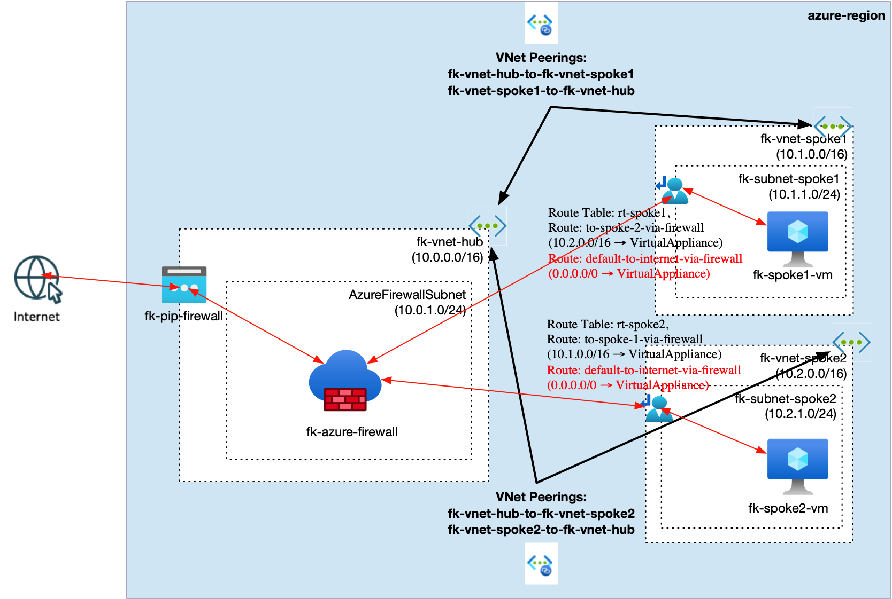
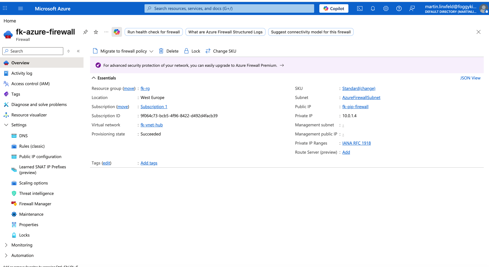
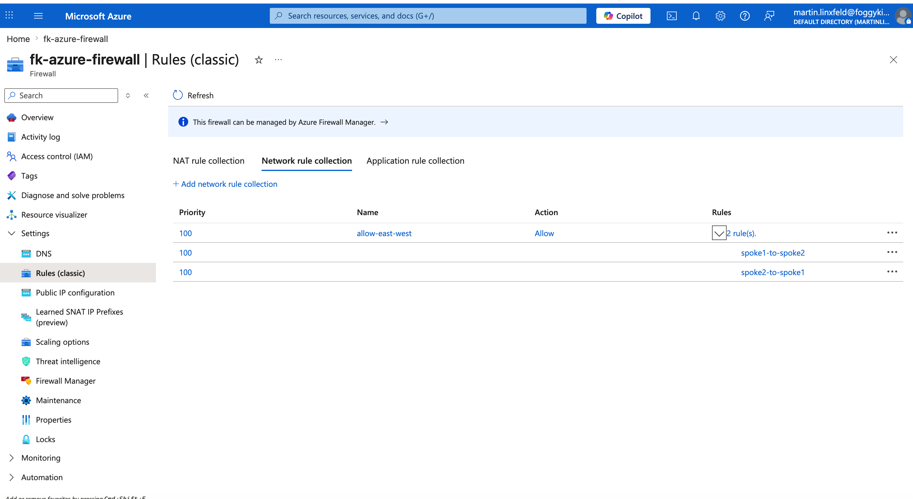
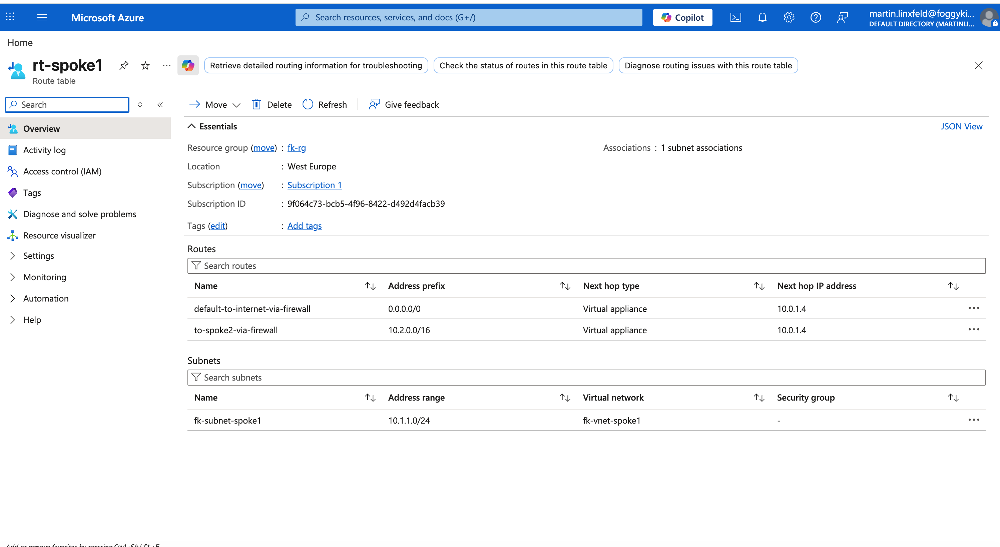
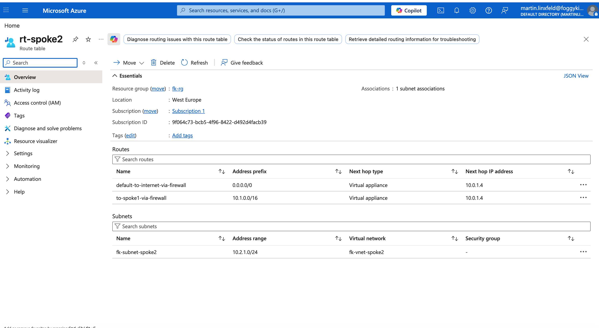
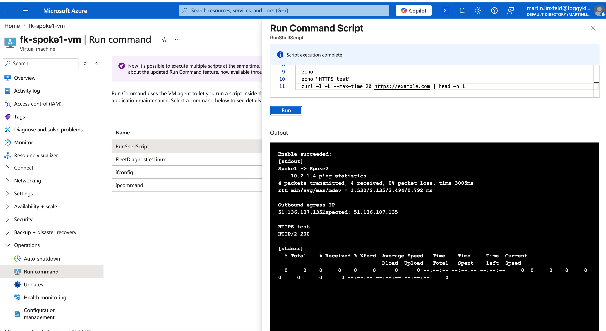

# Example 02: Hub-Spoke Transit and Centralized Egress via Azure Firewall

In this example, we deploy **Azure Firewall** in the Hub VNet and use it as the central next hop for both:

- **east-west traffic** between spokes
- **north-south outbound traffic** to the Internet

This example is the Azure Firewall equivalent of the dual-NIC NVA pattern from [terraform-az-fk-routing/examples/04_nva_dual_nic](https://github.com/mlinxfeld/terraform-az-fk-routing/tree/main/examples/04_nva_dual_nic), but replaces the router VM with a managed Azure Firewall.

## Architecture Overview



This deployment creates:

- A Resource Group
- Three Virtual Networks:
  - `fk-vnet-hub` (`10.0.0.0/16`)
  - `fk-vnet-spoke1` (`10.1.0.0/16`)
  - `fk-vnet-spoke2` (`10.2.0.0/16`)
- One Azure Firewall subnet in the Hub:
  - `AzureFirewallSubnet` (`10.0.1.0/24`)
- One subnet in each spoke:
  - `fk-subnet-spoke1` (`10.1.1.0/24`)
  - `fk-subnet-spoke2` (`10.2.1.0/24`)
- Standard public IP (via `terraform-az-fk-public-ip`):
  - `fk-pip-firewall`
- Bidirectional VNet peering:
  - Hub ↔ Spoke1
  - Hub ↔ Spoke2
- One Azure Firewall:
  - `fk-azure-firewall`
  - private IP allocated from `AzureFirewallSubnet`
  - attached to the Public IP for Internet egress
- One test VM in each spoke subnet:
  - `fk-spoke1-vm` (`10.1.1.4`)
  - `fk-spoke2-vm` (`10.2.1.4`)
- Two route tables:
  - `rt-spoke1`
  - `rt-spoke2`
- Four spoke routes:
  - inter-spoke route via the Azure Firewall private IP
  - default route `0.0.0.0/0` via the Azure Firewall private IP

With this design:

- traffic from `Spoke1` to `Spoke2` is sent to the firewall private IP
- traffic from `Spoke2` to `Spoke1` is sent to the firewall private IP
- outbound Internet traffic from both spokes is also sent to the firewall private IP
- Azure Firewall inspects and forwards the traffic according to its rule collections

## Why Replace the NVA

The dual-NIC NVA example is useful for learning UDR and transit routing, but it requires:

- guest OS routing configuration
- IP forwarding on NICs
- Linux NAT rules
- ongoing VM lifecycle management

Azure Firewall removes that operational burden while preserving the same architectural role in the hub:

- spokes still use Azure route tables with `VirtualAppliance`
- the next hop is now the Azure Firewall private IP
- east-west and outbound rules are managed declaratively in Azure Firewall

## Deployment Steps

Initialize and apply the configuration:

```bash
tofu init
tofu plan
tofu apply
```

No manual SSH public key input is required, because the example generates one automatically.

After deployment, Terraform will output:

- Hub, Spoke1, and Spoke2 VNet IDs
- Azure Firewall ID and private IP
- Firewall public IP ID
- Spoke1 VM ID and private IP
- Spoke2 VM ID and private IP
- Route table IDs
- Peering IDs

## Rule Design

The example configures two rule types on Azure Firewall:

- `network_rule_collections`
  - allow `10.1.0.0/16 -> 10.2.0.0/16`
  - allow `10.2.0.0/16 -> 10.1.0.0/16`
- `application_rule_collections`
  - allow HTTP/HTTPS outbound access from both spokes to `*`

This is intentionally minimal and focused on the transit-firewall pattern rather than a full production firewall policy.

## Validation Ideas

After deployment, you can validate:

- Inter-spoke routing:
  - `ping 10.2.1.4` from `fk-spoke1-vm`
  - `ping 10.1.1.4` from `fk-spoke2-vm`
- Centralized outbound egress:
  - `curl https://api.ipify.org`
  - `curl https://ifconfig.me`
- Effective routes on spoke NICs in Azure Portal:
  - inter-spoke CIDR routed to the firewall private IP
  - `0.0.0.0/0` routed to the firewall private IP

Expected result:

- inter-spoke traffic should traverse Azure Firewall
- outbound HTTP/HTTPS traffic should leave through the firewall public IP
- both spokes should use the same centralized inspection point

## Azure CLI Validation Commands

After `tofu apply`, capture the firewall public IP:

```bash
az network public-ip show \
  -g fk-rg \
  -n fk-pip-firewall \
  --query ipAddress \
  -o tsv
```

Validate routes on both spoke route tables:

```bash
az network route-table route list \
  -g fk-rg \
  --route-table-name rt-spoke1 \
  --query "[].{name:name,addressPrefix:addressPrefix,nextHopType:nextHopType,nextHopIpAddress:nextHopIpAddress}" \
  -o table

az network route-table route list \
  -g fk-rg \
  --route-table-name rt-spoke2 \
  --query "[].{name:name,addressPrefix:addressPrefix,nextHopType:nextHopType,nextHopIpAddress:nextHopIpAddress}" \
  -o table
```

Run validation from `fk-spoke1-vm`:

```bash
az vm run-command invoke \
  -g fk-rg \
  -n fk-spoke1-vm \
  --command-id RunShellScript \
  --scripts "echo 'Spoke1 -> Spoke2'; ping -c 4 10.2.1.4 | tail -n 3; echo; echo 'Outbound egress IP'; curl -4s https://api.ipify.org; echo; echo 'HTTPS test'; curl -I -L --max-time 20 https://example.com | head -n 1"
```

Run validation from `fk-spoke2-vm`:

```bash
az vm run-command invoke \
  -g fk-rg \
  -n fk-spoke2-vm \
  --command-id RunShellScript \
  --scripts "echo 'Spoke2 -> Spoke1'; ping -c 4 10.1.1.4 | tail -n 3; echo; echo 'Outbound egress IP'; curl -4s https://api.ipify.org; echo; echo 'HTTPS test'; curl -I -L --max-time 20 https://example.com | head -n 1"
```

## Validation Results

The example was deployed and validated on **2026-04-21** in `westeurope`.

Deployment summary:

- OpenTofu apply completed successfully: `28 added, 0 changed, 0 destroyed`
- Azure Firewall private IP: `10.0.1.4`
- Azure Firewall public IP: `51.136.107.135`
- Spoke1 VM private IP: `10.1.1.4`
- Spoke2 VM private IP: `10.2.1.4`

Route table validation:

```text
rt-spoke1
default-to-internet-via-firewall  0.0.0.0/0    VirtualAppliance  10.0.1.4
to-spoke2-via-firewall            10.2.0.0/16  VirtualAppliance  10.0.1.4

rt-spoke2
to-spoke1-via-firewall            10.1.0.0/16  VirtualAppliance  10.0.1.4
default-to-internet-via-firewall  0.0.0.0/0    VirtualAppliance  10.0.1.4
```

Inter-spoke validation from `fk-spoke1-vm`:

```text
PING 10.2.1.4 (10.2.1.4) 56(84) bytes of data.
4 packets transmitted, 4 received, 0% packet loss
```

Inter-spoke validation from `fk-spoke2-vm`:

```text
PING 10.1.1.4 (10.1.1.4) 56(84) bytes of data.
4 packets transmitted, 4 received, 0% packet loss
```

Outbound egress validation:

```text
fk-spoke1-vm curl -4s https://api.ipify.org -> 51.136.107.135
fk-spoke2-vm curl -4s https://api.ipify.org -> 51.136.107.135
fk-pip-firewall public IP                         51.136.107.135
```

Both spokes reached the Internet through the same Azure Firewall public IP, confirming centralized outbound egress.

## Azure Portal Verification

The following screenshots document the deployed hub-and-spoke transit-firewall topology and the validation path through Azure Firewall.

### 1. Azure Firewall Overview

- Azure Firewall `fk-azure-firewall` overview page
- resource group
- region
- SKU
- private IP and public IP summary if available

Purpose:

- confirms that Azure Firewall is deployed as the central managed inspection point in the hub VNet



### 2. Firewall Rule Collections

- network rule collection `allow-east-west`
- application rule collection `allow-web-egress`
- rules allowing spoke-to-spoke traffic and HTTP/HTTPS outbound access

Purpose:

- confirms that Azure Firewall has explicit rules for east-west transit and centralized outbound egress



### 3. Spoke Route Tables

- route table `rt-spoke1`
- route table `rt-spoke2`
- inter-spoke routes via `VirtualAppliance`
- default route `0.0.0.0/0` via `VirtualAppliance`
- next hop IP set to the Azure Firewall private IP

Purpose:

- confirms that both spoke subnets send inter-spoke and Internet-bound traffic to Azure Firewall





### 4. Workload VM Validation

- Azure Portal Run Command output from one spoke VM
- `ping` to the VM in the other spoke
- `curl -4s https://api.ipify.org`
- firewall public IP shown for comparison if possible

Purpose:

- confirms end-to-end inter-spoke connectivity
- confirms centralized outbound egress through the firewall public IP



## Design Notes

- This example keeps the same learning objective as the dual-NIC NVA topology
- The spokes still use Azure route tables with `VirtualAppliance` next hop
- Azure Firewall replaces custom router guest configuration with managed rule collections
- The module is intentionally scoped to the firewall layer only
- Routing remains handled by `terraform-az-fk-routing`

## Cleanup

To remove all resources:

```bash
tofu destroy
```

## Summary

This example demonstrates:

- how to replace a router VM or NVA with Azure Firewall in a hub-and-spoke topology
- how to keep Azure UDR logic simple while centralizing inspection and egress
- how to combine VNet, Peering, Routing, Compute, and Firewall modules into a practical transit design

## License

Licensed under the Universal Permissive License (UPL), Version 1.0.

---

© 2026 FoggyKitchen.com — Cloud. Code. Clarity.
